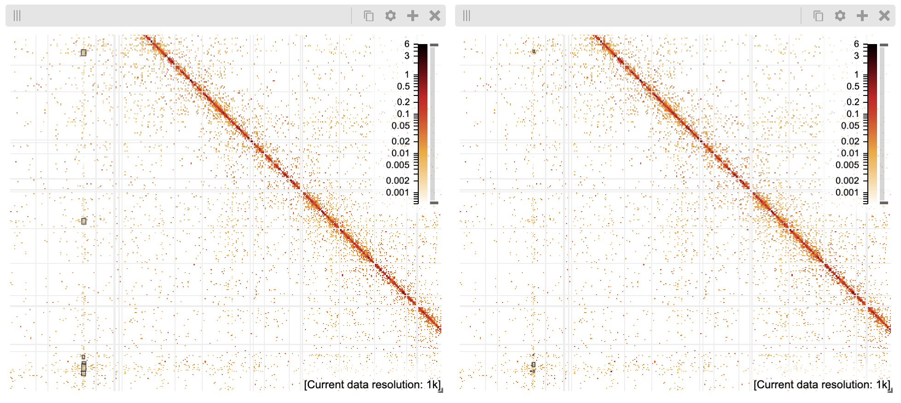

# Cluster Paired End Tags (PETs)

## Introduction

This project implements a paired end tags (PETs) clustering algorithm described in [CTCF-Mediated Human 3D Genome Architecture Reveals Chromatin Topology for Transcription](https://www.ncbi.nlm.nih.gov/pmc/articles/PMC4734140/) paper by _Tang et al. (2015)_. The algorithm is described in [Supplemental Information](https://www.ncbi.nlm.nih.gov/pmc/articles/PMC4734140/bin/NIHMS738408-supplement-01.pdf) as follows:

>Each PET was categorized as either a self-ligation PET (two ends of the same DNA fragment) or inter-ligation PET (two ends from two different DNA fragments in the same chromatin complex) by evaluating the genomic span between the two ends of a PET. PETs with a genomic span less than 8 kb are classified as self-ligation PETs and are used as a proxy for ChIP fragments since they are derived in a manner analogous to ChIP-Seq mapping for protein binding sites. PETs with a genomic span greater than 8 kb are classified as inter-ligation PETs and represent the long-range interactions of interest. To accurately represent the frequency of interaction between two loci and to define the interacting regions, both ends of inter-ligation PETs were extended by 500 bp along the reference genome, and PETs overlapping at both ends (with extension) were clustered together as one PET cluster.

>The number of PETs in a PET cluster reflects the frequency of interaction between two genomic regions. In this study, the uniquely mapped and non-redundant PETs from all replicates of GM12878 CTCF and RNAPII libraries were combined for PET cluster generation, respectively. The combined GM12878 CTCF and RNAPII ChIA-PET libraries were both deeply sequenced (Table S1). We therefore set the PET count cutoff for PET clusters as 4 for GM12878.

>We observed that a lot of anchors of distinct PET clusters were located within the same protein factor binding peak. It is clear that these binding peaks reflect the real chromatin interaction loci in the nucleus. In order to streamline the PET clusters data structure, we collapsed the individual anchors of all PET clusters with 500 bp extensions to generate merged anchors. We then used the merged anchors to further cluster raw PET clusters. See Figure S2B for schematic illustration. Throughout the text, the merged PET clusters are referred to as interactions or connections. Un-clustered individual inter-ligation PETs and PETs in the clusters below the PET cutoff are referred as singletons.

## Installation and Usage

Download the source code from the GitHub:
```
git clone git@github.com:cellular-genomics/cluster-paired-end-tags.git
cd cluster-paired-end-tags
```

Install required Python packages:
```
pip install -r requirements.txt
python setup.py install
```

## Usage

The `cluster_PETs` program accepts the following command line arguments:

`--pets_filename` - the .bedpe input file with all the PETs. Tab delimited. No header.

`--clusters_filename` - the .bedpe output file where the PET clusters will be saved. Tab delimited. No header.

`--extension` - the number of base pairs to add to the start and end regions of each PET. Default extension is 500bp.

`--self_ligation` - the genomic span width to consider PET as self-ligation. Default is 8000bp. The self-ligating PETs are not considered during clustering.

`--pet_cutoff` - the PET count cutoff. Default is 2. PETs with count below the PET cutoff are not considered during clustering.

`--cluster_cutoff` - the PET cluster cutoff. Default is 4. PET clusters with count below the cluster cutoff are not reported in the output results.

Example usage:
```
python cluster_PETs.py --pets_filename 4DNFI2BAXOSW_GM12878_CTCF_rep1_hiseq.bedpe --clusters_filename 4DNFI2BAXOSW_GM12878_CTCF_rep1_hiseq.bedpe.2.15.50.clusters -pet_cutoff 2 -cluster_cutoff 15 -extension 50
```

## Determining parameters

The clustering parameters used in the original paper were the following:
* Extension: `500bp`
* Self ligation: `8000bp`
* PET cutoff: `2`
* Cluster cutoff: `4`

Such parameters generate much more (10x) clusters comparing to the results from the original paper. The [HiSeq GM12878 CTCF in situ ChIA-PET Rep 1 intra-chromosomal loops file](https://data.4dnucleome.org/files-processed/4DNFI2BAXOSW/) results with the comparable number of clusters when the program is run with the following parameters:
* Extension: `50bp`
* Self ligation: `8000bp`
* PET cutoff: `2`
* Cluster cutoff: `15`

## Comparison with the original clusters

The [GM12878 CTCF PET clusters](https://www.ncbi.nlm.nih.gov/geo/query/acc.cgi?acc=GSM1872886) from the original paper were lifted over from `hg19` to `hg38` and displayed side by side in the [HiGlass](http://higlass.io/) viewport: the clusters generated with this tool on the left and the original clusters to the right:



Side note. In order to display `.bedpe` files in HiGlass you need to convert them to the `.multires` format using the [cloduis tool](https://github.com/higlass/clodius) first:

```
clodius aggregate bedpe --assembly hg38 --output-file 4DNFI2BAXOSW_GM12878_CTCF_rep1_hiseq.bedpe.2.15.50.clusters.multires 4DNFI2BAXOSW_GM12878_CTCF_rep1_hiseq.bedpe.2.15.50.clusters
```

## Further work

* determine the best parameters for different experiments

## Legacy C++ version. Installation and compilation

The original version of the program was written in C++ as I couldn't get the desired performance in Python. After discovered `numba` framework I switched to Python and the C++ code is no longer maintained.

Download the source code from the GitHub:
```
git clone git@github.com:cellular-genomics/cluster-paired-end-tags.git
cd cluster-paired-end-tags
```

Install [Boost](https://www.boost.org/) framework needed by the C++ script:
```
conda install boost
```

Compile the script. Replace `BOOST_LIB_FOLDER` with the location of your boost libraries (e.g. `~/opt/miniconda3/envs/bio/lib/)`)
```
/usr/bin/clang++ -std=c++17 -stdlib=libc++ cluster_PETs.cpp -o cluster_PETs -g <BOOST_LIB_FOLDER>/libboost_iostreams.a <BOOST_LIB_FOLDER>/libboost_program_options.a 
```
